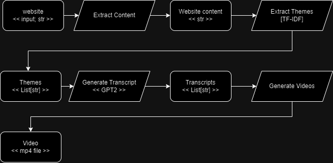
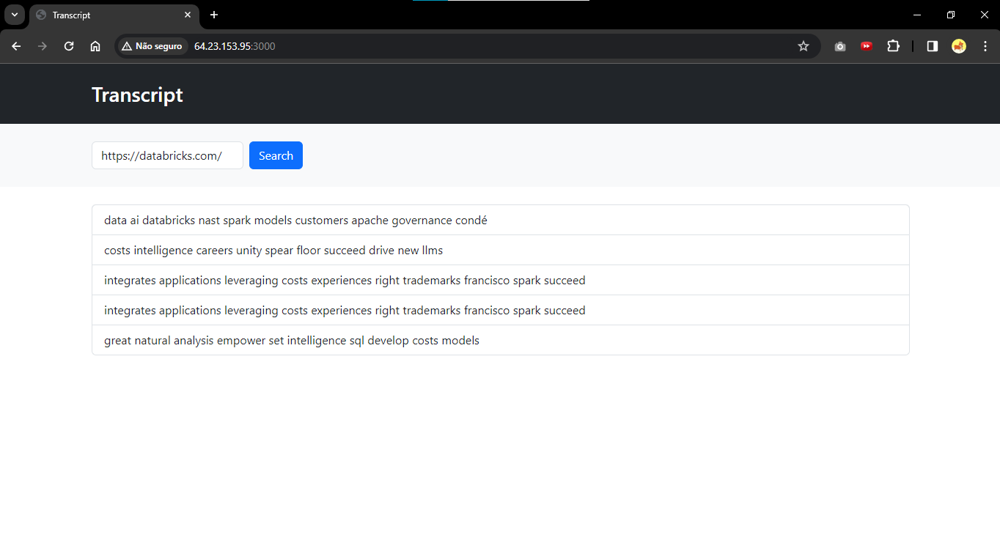

# Video from Website



## Features

This application provides a set of features to facilitate the extraction and generation of video content from a website.

- **Website Content Extraction:** Extract textual content from a specified website, allowing you to gather relevant information for video creation.

- **Transcript Generation:** Automatically generate a transcript from the extracted content. This transcript can be utilized for various purposes, including creating branded video ads.

- **Video File Generation:** Based on the provided transcript, the application can generate a video file, streamlining the process of content creation for your videos.

## Installation

To get started, you'll need to have Docker installed on your system. The following instructions explain how to install and run the application using Docker.

### Without GPU (General Processing)

If you don't have a GPU for accelerated processing, you can use the following commands to build and run the application:

```sh
docker-compose -f docker-compose-without-gpu.yml build
docker-compose -f docker-compose-without-gpu.yml up -d
```

### Using GPU (Accelerated Processing)

If you have a GPU and want to leverage accelerated processing, use the following commands:

```sh
docker-compose -f docker-compose-using-gpu.yml build
docker-compose -f docker-compose-using-gpu.yml up -d
```

These commands will build the necessary Docker images and start the application in detached mode. Ensure that you have the required dependencies, and the application will be ready to use.

# Running Docker Compose in ./local_app

To run the Docker Compose with the `docker-compose.yml` file located in the `./local_app` directory, follow these steps:

1. Open a terminal and navigate to the directory where the `docker-compose.yml` file is located (`./local_app`).

2. Run the following command to build the image and start the container:

```sh
   docker-compose up -d
```

## Accessing the Project

Once the application is up and running, you can access the project components locally:

API: Visit http://your_url:5000/ to interact with the API endpoints.

LocalApp: Visit http://your_url:5001/ to interact with the LocalApp.

Frontend: Explore the frontend by navigating to http://your_url:3000/


